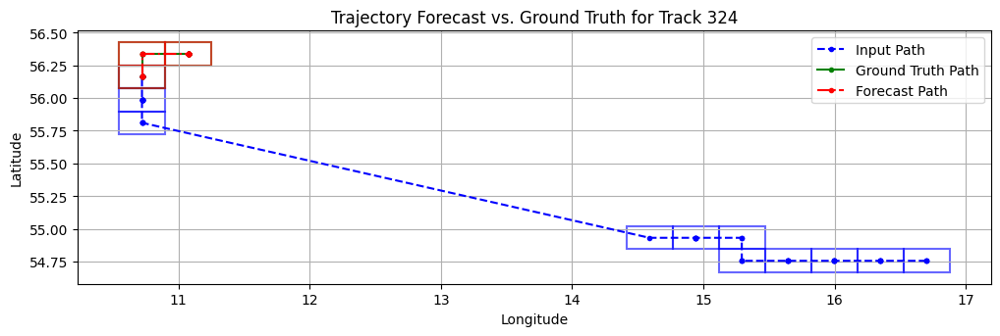

# TrackGPT-mini – Proof-of-Concept README  
*A lightweight baseline re-implementation of “[TrackGPT](https://arxiv.org/abs/2402.00066) – A generative pre-trained transformer for cross-domain entity trajectory forecasting”*

## 1. What this repo is (and what it isn’t)

This codebase is a **minimal, sanity-check reproduction** of the TrackGPT model using a **tiny AIS slice (26 Jul 2025 → 31 Jul 2025)** so that it can train on Google Colab’s free T4 GPU.  

The original paper (https://arxiv.org/abs/2402.00066) trained a 792 M-parameter model on ~700 million AIS messages; their code is not open-source.  
Here you’ll find:

* a NanoGPT fork trimmed to a **mini decoder-only model**   
* TrackGPT-style **geohash tokenizer** (fixed `'u'` prefix + 3-char suffix + east/west flag = **3.5-char → 16-bit token → vocab_size = 65,536** as per § 3.1 of the paper).  
* modified dataloading that keeps each trajectory intact in a block (§ 3.4).  
* NO Forecast Regulator (§ 3.3) – the paper is too vague; left for future work.  

Because of the miniature dataset and reduced model size **this repo is *not* suitable for operational AIS forecasting** – it is a  baseline proof-of-concept.

## 2. Folder / file tour — changed or added vs. upstream NanoGPT

| Path | Purpose |
|------|---------|
| `config/train_trackgpt_mini.py` | Training hyper-params (block_size = 48 = 8 h window) |
| `data/ais/prepare.py` | Encodes geohashes → `uint16` tokens (fixed `'u'` prefix, east/west bit) |
| `data/preprocess.ipynb` | Interpolation & 10-min resampling (§ 3.2) |
| `data/combine_datasets.ipynb` | Concatenate daily pre-processed files |
| `train_trackgpt.py` | Replaces NanoGPT’s `train.py`; uses trajectory-aware batching (§ 3.4) |
| `sample-trackgpt.py` | Legacy sampler with geohash decode (kept for reference) |
| `forecast.py` | **Main inference script** – takes track index + optional input/forecast lengths |

## 3. Installation

```
pip install torch numpy transformers datasets tiktoken wandb tqdm pygeohash
```

Dependencies:

- [pytorch](https://pytorch.org) <3
- [numpy](https://numpy.org/install/) <3
-  `transformers` for huggingface transformers <3 (to load GPT-2 checkpoints)
-  `datasets` for huggingface datasets <3 (if you want to download + preprocess OpenWebText)
-  `tiktoken` for OpenAI's fast BPE code <3
-  `wandb` for optional logging <3
-  `tqdm` for progress bars <3
- `pygeohash` for geohashing


The project runs on Python 3.10+ and PyTorch 2.x.  A Colab free tier T4 (16 GB VRAM) is enough for the mini config.

## 4. Usage

### 4.1 Data pipeline

1. **Download data**

    Daily raw AIS CSVs downloaded from https://dma.dk/safety-at-sea/navigational-information/ais-data. The daily datasets should go into `data/ais/raw_data/`.

2. **Run data/preprocess.ipynb and data/preprocess.ipynb on the data**

    Make sure the final dataset `ais_preprocessed.csv` is in the `data/ais/` directory.

3. **Encode & split**  
   ```bash
   python data/ais/prepare.py
   ```

### 4.2 Train

```bash
python train_trackgpt.py config/train_trackgpt_mini.py
```

Default mini hyper-params can be found in `config/train_trackgpt_mini.py`

Checkpoints land in `out-trackgpt/`. I stopped at Step 4250: train loss 0.2726, val loss 0.4579 using such hyper-params.

### 4.3 Forecast

Data were sampled every **10 min**, so each token ≈ one 10-minute step.  

Example:

```bash
python forecast.py 324 24 20
```
-  uses 24 past tokens (4 h) to predict 20 future tokens (3 h20 min).  
Outputs three geohash sequences: context, forecast, ground-truth.

Arguments  
1. `track_idx` – row index into `val_track_offsets.npy` (not the original `sub_track` id).  
2. `input_len` – timesteps fed to the model (default 48).  
3. `forecast_len` – timesteps to generate (default 12).

#### Example 3-Hour Forecast: ####


## 5. Known limitations / open questions

* **Coarse 3.5-character resolution (≈ 2.4 km at 55 °N)** leaves the dataset with many near-stationary tracks, even with the 1-character prefix. In the forecast above, you can see that a 3 hour trajectory spans just 3 unique geohashes with this precision. 

  In practice, finer geohashes are needed for vessel-scale tracking, casting doubt on the very optimistic benchmarks in the paper. However, this limitation is noted in the paper as each addition character makes the maximum vocabulary size explode by a factor of 32 tokens.
* **Tiny corpus (≈ 2 M rows)** + **miniature model** → high bias; expect bland forecasts.  
* **No Forecast Regulator (§ 3.3)** – paper omits implement-ation details.  

## 6. Next steps

* Implement multi-prefix or dynamic-shift encoding to unlock higher precision without exploding vocab size.  
* Reproduce the Forecast Regulator (gap-filter + ensemble) once clearer guidance is available.